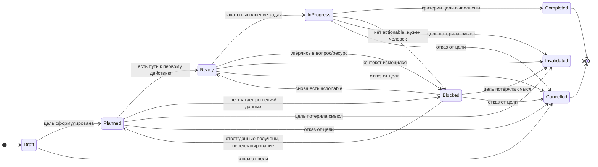

# 🔁 Граф состояний цели (UTEP Goal FSM)

## Как интерпретировать Goal FSM

* **Draft** — мысль, набросок, формулировка без обязательств.
* **Planned** — цель принята, но путь может быть ещё не готов.
* **Ready** — существует хотя бы одно осмысленное действие (`Actionable` задача).
* **InProgress** — выполнение идёт (есть/были действия, ведётся работа).
* **Blocked** — цель упёрлась в внешнее решение/ограничение (обычно вопрос пользователю).
* **Completed** — критерии цели выполнены.
* **Cancelled** — цель отвергнута решением человека.
* **Invalidated** — цель утратила смысл (реальность изменилась).

---

# 🧭 Аннотация агенту: “как действовать по протоколу”

## 0) Главный закон агента

> Агент **не управляет** целью и задачами напрямую.
> Агент **управляет только через CLI** и следует `utep next`.

Запрещено:

* редактировать файлы руками,
* “самому решать”, что задача закрыта, без evidence,
* выполнять задачи “по ощущениям” без `next`.

---

## 1) Цикл агента (неизменяемый)

1. `utep next --count 5 --json`
2. Если есть actionable:

   * выбрать первую (или по наибольшему blocks_count)
3. Если actionable нет:

   * если `blocking.kind == "user"` → задать вопрос пользователю и остановиться
   * если `blocking.kind == "dependencies"` → работать над рекомендованным блокером (через `utep bottlenecks`)
4. `utep task show <id> --json`
5. Проверка актуальности
6. `utep task start <id>`
7. Выполнение → `utep task attempt ...`
8. Завершение → `utep task complete ...` или `utep task block ...`
9. `utep render`
10. `utep validate`
11. Повтор

---

## 2) Что агент обязан проверять перед каждым переходом Task FSM

Ниже — таблица “переход → обязательные проверки → команды”.

### 2.1 Draft → Planned / Cancelled

**Когда:** задача создана, но ещё “сырая”.

**Проверки:**

* задача действительно нужна для цели?
* есть ли хотя бы минимальная формулировка результата?

**Команды:**

* создание: `utep task new ...`
* отмена: `utep task cancel <id> --reason "..."`
* перевод в planned: `utep task set-status <id> Planned --note "..."`

> На практике агент редко трогает Draft, его зона начинается с Ready/Blocked.

---

### 2.2 Planned → Ready

**Когда:** задача достаточно определена, чтобы сделать одну попытку.

**Проверки (минимум):**

* есть `success_criteria` (не пустые)
* нет `open_questions` (или они не блокируют)
* зависимости сняты (через computed поля)
* confidence не ниже порога, либо задача осознанно “пробная”

**Команды:**

* `utep task set-status <id> Ready --note "criteria defined"`

---

### 2.3 Ready → InProgress (start)

**Когда:** агент реально собирается делать работу.

**Проверки (обязательные):**

1. **Актуальность**: задача всё ещё ведёт к цели?
2. **Actionable**: нет ожидания зависимостей (`waiting_dependencies` пусто)
3. **Не заблокирована пользователем**: статус не Blocked
4. **Стабильность контекста**: входные данные не поменялись

**Команды:**

* просмотр: `utep task show <id> --json`
* старт: `utep task start <id> --note "Starting"`

Если выяснилось, что не актуальна:

* `utep task invalidate <id> --reason "..."`
* затем `utep render` и назад к `utep next`

---

### 2.4 InProgress → Completed (complete)

**Когда:** критерии успеха выполнены.

**Проверки (жёсткие):**

* каждый пункт `success_criteria` выполнен или явно подтверждён
* есть evidence (текст или ссылка на артефакт)
* если есть `needs_review` — сначала обновить понимание/критерии

**Команды:**

* `utep task complete <id> --evidence "..."`

CLI должен:

* добавить evidence,
* запустить ParentCheck,
* обновить index.

---

### 2.5 Ready/InProgress → Blocked (block)

**Когда:** без внешней информации/решения двигаться нельзя.

**Проверки:**

* действительно нельзя продвинуться локально?
* неопределённость классифицирована (informational/goal/architectural/process)
* подготовлены 2–4 варианта с плюсами/минусами/рисками
* сформулирован конкретный ответ, который нужен

**Команды:**

* подготовить файл вопроса: `questions/<task_id>.question.json`
* `utep task block <id> --question-file questions/<task_id>.question.json`

После этого агент обязан:

* показать вопрос пользователю,
* остановиться до ответа.

---

### 2.6 Любое состояние → Invalidated

**Когда:** контекст изменился, задача утратила смысл.

**Проверки:**

* причина связана с изменением цели/ограничений/входа
* это не “ошибка выполнения” (ошибка = повод уточнить, не invalidated)

**Команды:**

* `utep task invalidate <id> --reason "..."`
* `utep render`

---

### 2.7 Любое состояние → Cancelled

**Когда:** человек сознательно отменил.

**Проверки:**

* есть явное решение человека/политики

**Команды:**

* `utep task cancel <id> --reason "User decided ..."`

---

## 3) Что агент обязан делать при “нет actionable”

Это критично, потому что именно здесь многие агенты “ломаются”.

### Сценарий A: WaitingUser

**Симптом:** `utep next` exit code 5 и `blocking.kind == "user"`

**Действие:**

* вывести пользователю `blocking.question` (строго как есть)
* остановиться

**Запрещено:**

* придумывать ответ за пользователя
* менять задачу без ответа

---

### Сценарий B: WaitingDependencies

**Симптом:** `blocking.kind == "dependencies"`

**Действие:**

1. `utep bottlenecks --top 5 --json`
2. выбрать блокер, который:

   * сам actionable, либо
   * приводит к actionable ветке быстрее всего
3. вернуться в цикл `next` и начать выполнять блокер

---

### Сценарий C: Degraded mode / validation errors

**Симптом:** validate сообщает ошибки, но next ещё может что-то выдавать.

**Действие:**

* продолжать работу над actionable задачами
* параллельно предложить человеку:

  * `utep doctor --fix` или список remedies из doctor

**Запрещено:**

* “останавливать весь процесс” только из-за валидации, если есть actionable

---

## 4) Аннотация к Goal FSM (что делает агент)

Агент напрямую **не переводит цель по статусам** — это делает CLI по факту состояния задач.

Но агент должен понимать признаки:

### Goal = Ready

* существует хотя бы одна actionable задача

### Goal = InProgress

* агент начал и выполняет задачи, есть evidence/attempts

### Goal = Blocked

* `utep next` возвращает `WaitingUser` и нет другого пути

### Goal = Completed

* CLI может определить это когда выполнены критерии цели (или все нужные верхние задачи terminal)

Если CLI умеет `utep goal set-status` — агент не должен использовать без явной инструкции человека.

---

## 5) Минимальные “правила здравого смысла” для агента

1. Если можно действовать — действуй.
2. Если нельзя действовать — объясни, почему, и что нужно.
3. Если действие потеряло смысл — признай это и зафиксируй.
4. Если застрял — остановись и попроси решение.
5. Никогда не скрывай неопределённость.
