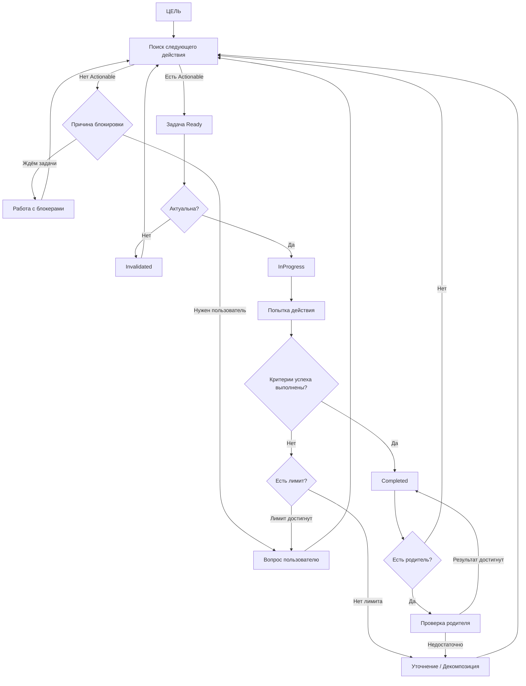

# 📜 UNLIMOTION · UTEP MANIFESTO

## Манифест управляемого действия в изменчивой реальности

---

### 1. Реальность важнее плана

Мы признаём:
реальность меняется быстрее, чем любой план.

Поэтому:

* план не является истиной,
* план — это временная гипотеза,
* выполнение плана без проверки актуальности — ошибка.

---

### 2. Неопределённость — это среда, а не сбой

Мы не пытаемся устранить неопределённость заранее.
Мы учимся **действовать внутри неё**.

Неопределённость:

* не маскируется,
* не игнорируется,
* не “дожимается силой”.

Она:

* фиксируется,
* классифицируется,
* эскалируется осмысленно.

---

### 3. Действие допустимо только при наличии смысла

Любое действие должно отвечать на вопрос:

> *Зачем это сейчас?*

Если ответ потерян — действие прекращается,
задача признаётся утратившей актуальность.

Мы предпочитаем **не делать**,
чем делать бессмысленное.

---

### 4. Задача — это гипотеза, а не приказ

Задача не является обязательством.
Задача — это предположение, что:

> *данное действие приблизит цель.*

Следовательно:

* задачи могут быть неверными,
* задачи могут устаревать,
* выполнение задачи не гарантирует результата.

Результат проверяется, а не предполагается.

---

### 5. Планирование происходит ровно настолько, насколько необходимо

Мы отвергаем:

* тотальное планирование,
* детализацию “на будущее”,
* декомпозицию ради декомпозиции.

Мы принимаем:

* отложенное планирование,
* рекурсивную достаточность,
* детализацию по требованию.

---

### 6. Ошибка — это сигнал, а не провал

Ошибка означает:

* неверную гипотезу,
* неверную формулировку,
* неверный уровень абстракции.

Ошибка не наказывается.
Ошибка **используется для корректировки движения**.

---

### 7. Если нельзя двигаться — нужно остановиться и спросить

Мы запрещаем:

* бесконечные попытки,
* “дожим” без пересмотра,
* молчаливые допущения.

Если движение невозможно:

* формулируется вопрос,
* предлагаются варианты,
* принимается осознанное решение.

---

### 8. Смысл и порядок — разные измерения

Мы различаем:

* **иерархию** — зачем существует задача,
* **зависимости** — в каком порядке она может выполняться.

Смешение этих измерений порождает хаос.

---

### 9. Истина должна быть зафиксирована

Если что-то сделано, решено или отвергнуто —
это должно быть отражено в системе.

То, что не зафиксировано,
считается **непроизошедшим**.

---

### 10. ИИ — исполнитель, а не арбитр реальности

Мы не доверяем агенту:

* определять правила,
* менять процесс,
* решать, что “достаточно хорошо”.

ИИ:

* исполняет,
* исследует,
* предлагает.

Решения фиксируются через протокол.

---

### 11. Человек — источник смысла

Человек не управляет задачами.
Человек:

* задаёт цели,
* принимает решения в неопределённости,
* определяет ценности.

Система освобождает человека
от контроля — оставляя выбор.

---

### 12. Лучше корректно двигаться, чем быстро бежать

Мы не оптимизируем скорость.
Мы оптимизируем **направление движения**.

> *Медленное, но осмысленное движение
> превосходит быструю деградацию.*

---

## Ключевая формула Unlimotion

> **Не делай то, что утратило смысл.
> Не продолжай то, что не работает.
> Не скрывай то, чего не знаешь.
> Фиксируй реальность.
> Двигайся дальше.**

---

# 🧠 СХЕМА МЫШЛЕНИЯ И АЛГОРИТМА UTEP

Ниже — **концептуальная схема**, показывающая не просто шаги, а **логику переходов состояний**.

---

## 🗺️ Схема (Mermaid)

---

## 🧩 Пояснение к схеме

### 1. Поиск действия

Система **не выполняет всё подряд**, а ищет:

* готовые,
* актуальные,
* незаблокированные задачи.

Если таких нет — это **сигнал**, а не ошибка.

---

### 2. Проверка актуальности

Любое действие предваряется вопросом:

> *Имеет ли это смысл прямо сейчас?*

Если нет — задача **не плохая**, а **устаревшая**.

---

### 3. Попытка, а не “выполнение”

UTEP не требует “сразу всё сделать”.
Он требует **одной осмысленной попытки**.

---

### 4. Проверка результата

Результат сравнивается с критериями,
а не с ожиданиями или желаниями.

---

### 5. Ограничения и остановка

Если попытки исчерпаны —
движение **останавливается осознанно**,
а не продолжается по инерции.

---

### 6. Подъём вверх

Завершение подзадачи **не гарантирует**,
что родительская задача достигла цели.

Родитель пересматривается.

---

### 7. Возврат к поиску

Система **постоянно возвращается** к поиску следующего корректного шага.

Это замкнутый цикл корректного движения.

---

## 🧠 Как читать эту схему

* Это не pipeline.
* Это не workflow.
* Это **петля осмысленного действия**.

UTEP — это **алгоритм мышления**,
который можно исполнять как человеком, так и ИИ.

---

## Финальная мысль

> **UTEP — это попытка формализовать здравый смысл
> там, где обычно царит либо хаос, либо иллюзия контроля.**
