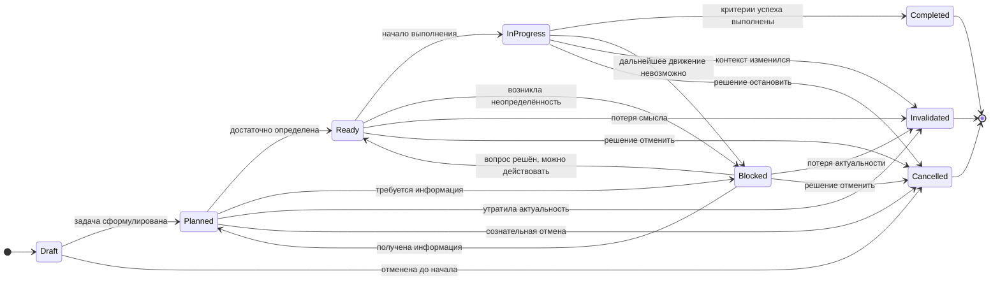

# 🔁 Граф переходов состояний задачи (UTEP)

## Mermaid state diagram

---

## 🧠 Как читать этот граф

### 1. Это **не процесс**, а **карта реальности**

Стрелки означают не “что надо делать”, а:

> *какие состояния допустимы и осмысленны при изменении контекста*

---

### 2. `Draft` — мысль, а не обязательство

* Задача может умереть, так и не став действием
* Отмена на этом этапе — норма, а не ошибка

---

### 3. `Planned` → `Ready` — ключевой переход

Он означает:

* неопределённость снижена до допустимого уровня
* можно сделать **одну осмысленную попытку**

---

### 4. `Ready` ≠ `InProgress`

`Ready` — это:

> *можно начать прямо сейчас*

`InProgress` — это:

> *мы начали и взяли на себя обязательство проверить результат*

---

### 5. `Blocked` — осознанная остановка

Это **не провал** и не “пауза”.

`Blocked` означает:

* дальнейшее движение невозможно без внешнего решения
* вопрос сформулирован и зафиксирован

---

### 6. `Invalidated` — уважение к реальности

Задача может быть:

* правильной вчера
* бессмысленной сегодня

`Invalidated` — это признак **здоровой системы**, а не ошибки планирования.

---

### 7. Терминальные состояния — разные смыслы

| Статус      | Смысл                                 |
| ----------- | ------------------------------------- |
| Completed   | гипотеза подтверждена                 |
| Cancelled   | гипотеза сознательно отвергнута       |
| Invalidated | гипотеза утратила связь с реальностью |

Все три **равноправны** как завершения.

---

## 🔎 Важное: чего здесь НЕТ

### ❌ Нет `WaitingDependencies`

Потому что это **вычисляемое состояние**, а не онтологическое.
Задача может быть `Ready`, но временно невыполнима.

---

### ❌ Нет “ошибочных” переходов

Любой переход здесь — допустим при корректной фиксации причины.

---

## 🧩 Инварианты FSM

1. Нет возврата из терминальных состояний
2. Любое состояние объясняет *почему задача сейчас не выполняется или выполняется*
3. `Completed` невозможно без критериев и evidence
4. `Blocked` невозможно без сформулированного вопроса

---

## 🧠 Ключевая идея графа

> **Задача — это не шаг в плане,
> а объект, отражающий текущее знание о реальности.**

Состояние задачи — это состояние нашего понимания,
а не просто этап выполнения.
